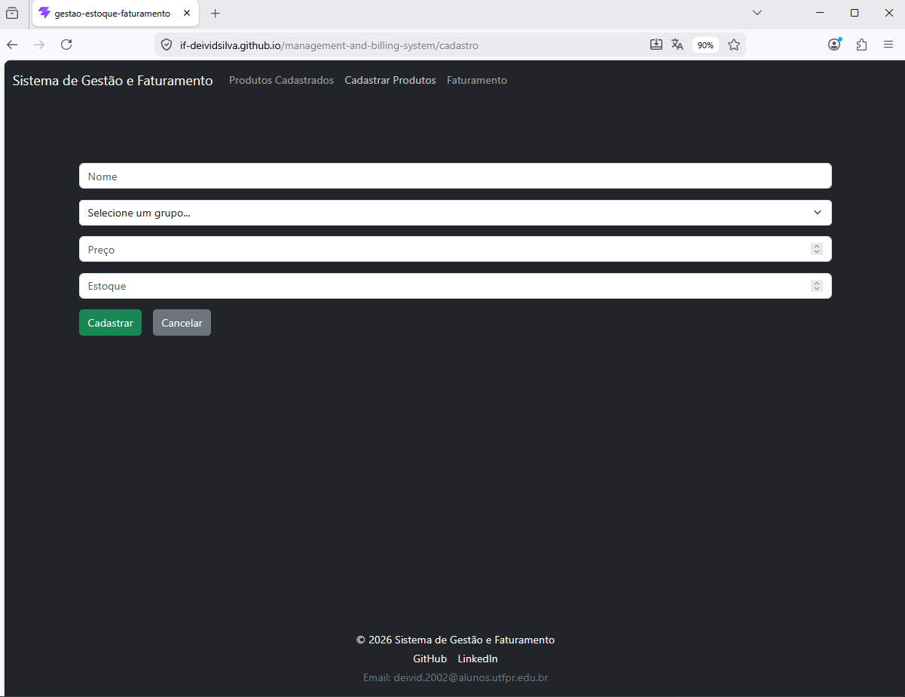
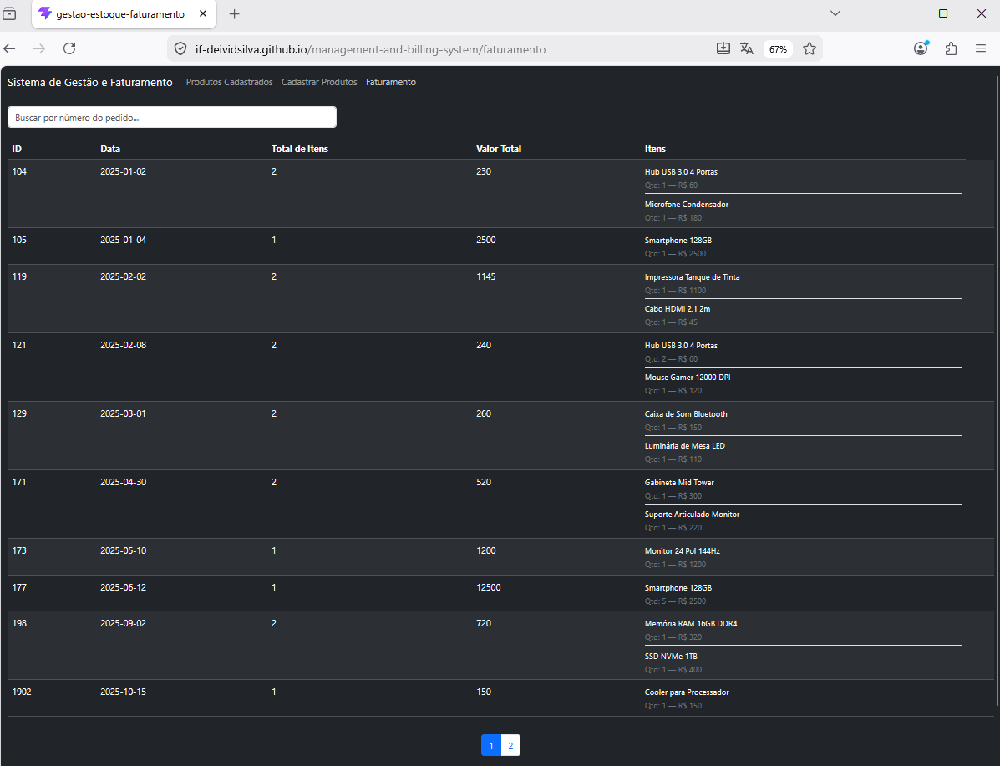
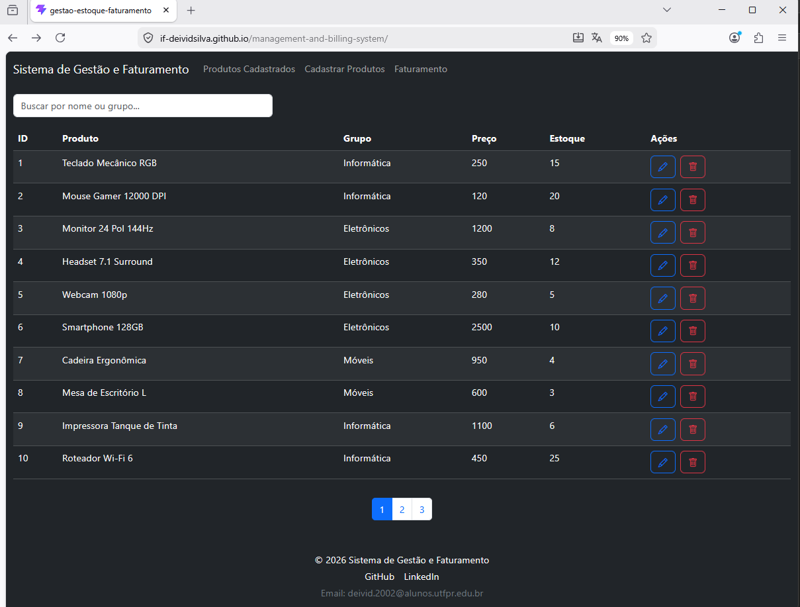

#  Sistema de Gestão de Produtos

##  Descrição
Aplicação web (SPA) desenvolvida em React para gerenciamento de produtos, incluindo cadastro, listagem e faturamento.

---

##  Tecnologias
- React (JavaScript)
- React Router DOM — navegação entre páginas
- React Toastify — feedback visual de ações
- Context API — gerenciamento de estado global
- Bootstrap
- API REST (My JSON Server)

---
## Arquitetura
```plaintext
src/
├── context/          ← estado global (Context API)
├── services/         ← configuração base do fetch (api.js)
├── components/       ← componentes 
└── pages/            ← telas da aplicação
```
---

## Funcionalidades

###  Navegação
-  Produtos Cadastrados                             (DONE)
-  Faturamento                                      (DONE)
-  Cadastrar Produtos                               (DONE)

---

### Produtos Cadastrados
- Paginação                                         (DONE)
- Ordenação (ASC/DESC em todas as colunas)          (DONE)  
- Filtro por Nome e Grupo                           (DONE)
- Edição de produtos   (Toast)                      (DONE)
- Exclusão com feedback (Toast)                     (DONE)

---

### Faturamento
- Paginação                                         (DONE)
- Ordenação                                         (DONE) 
- Filtro                                            (DONE)

---

### Cadastro de Produtos
- Campos: Nome, Grupo, Preço de Venda, Quantidade   (DONE)
- Select envia ID do grupo                          (DONE)
- Validação de campos obrigatórios                  (DONE)
- Feedback de erro (Toast + destaque)               (DONE)
- Feedback de sucesso (limpar formulário + Toast)   (DONE)

---
## Screenshots das paginas

### Produtos Cadastrados


### Faturamento


### Cadastro de Produtos


---

## Como rodar

```bash
# instalar dependências
npm install

# rodar em desenvolvimento
npm run dev
```

---

##  Status do Projeto
- Funcionalidades principais concluídas e em funcionamento
- Pagina disponivel Online